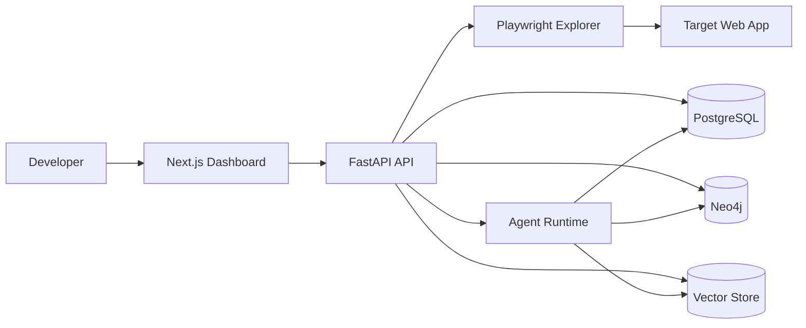
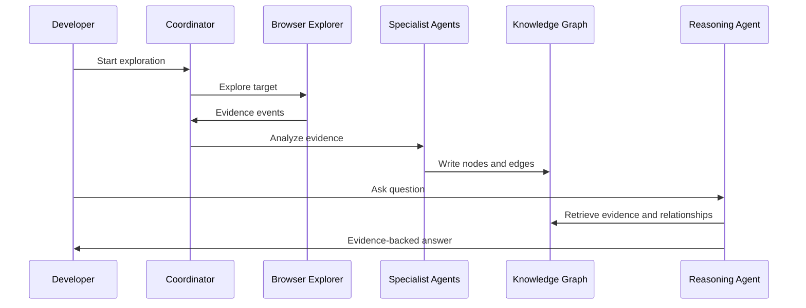

# Dex Architecture

Dex is built around evidence collection, structured modeling, and explanation.

## System Context

## Backend Boundaries

- `api`: HTTP routes and request/response schemas.
- `core`: configuration, logging, and application wiring.
- `domain`: stable business concepts such as projects, sessions, evidence, graph nodes, and agents.
- `agents`: coordinator and specialist agent contracts.
- `exploration`: browser automation and runtime evidence collection.
- `storage`: database, graph, and vector store adapters.

## Evidence Model

Evidence is the core primitive. Every analysis result should point back to collected observations such as:

- DOM snapshots.
- Screenshots.
- Network requests and responses.
- Console logs.
- JavaScript errors.
- Navigation events.
- Source files.
- Dependency metadata.

## Agent Flow

## Design Principles

- Evidence before explanation.
- Small modules with clear responsibilities.
- Explicit contracts between agents.
- Structured storage before LLM reasoning.
- Incremental exploration with resumable sessions.
- Plugin-friendly boundaries for future targets.
